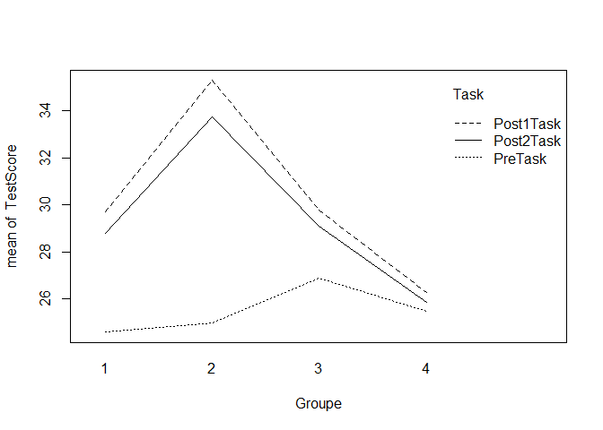
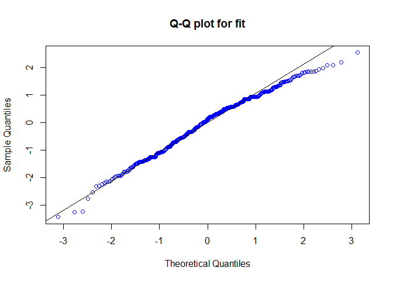

# ANOVA analysis for a RBD experiment

In order to study the influence of different teaching methods in L2 students learning, 180 students of similar ages and academic levels were randomly assigned to four different groups, from which 1 was the control group. The students were asked to complete a Pre-task test for which the score was recorded, then given a lesson using a different teaching method for each group, and then were asked to complete a test again at two different times. 

## Load the data 

The first step is to load the data. We will do so and display the first and last couple of rows. 


```r
# library needed to read .sav files
library(haven)
```

```
## Warning: package 'haven' was built under R version 3.5.3
```

```r
# get the path of the file 
path = file.path("C:\\Users\\jairp\\Desktop\\ANOVA\\Lyster.Written.sav")
dataset = read_sav(path)
head(dataset, n = 6L) # display the first 5 rows of the data. 
```

```
## # A tibble: 6 x 5
##   Participant        Groupe PreTaskCompl Post1TaskCompl Post2TaskCompl
##         <dbl>     <dbl+lbl>        <dbl>          <dbl>          <dbl>
## 1           1 1 [FFIrecast]           34             34             33
## 2           2 1 [FFIrecast]           25             28             27
## 3           3 1 [FFIrecast]           25             33             32
## 4           4 1 [FFIrecast]           27             37             36
## 5           5 1 [FFIrecast]           31             35             31
## 6           6 1 [FFIrecast]           26             29             27
```

```r
# Notice the repeated measurements per subject!   
```


```r
tail(dataset, n=6L)
```

```
## # A tibble: 6 x 5
##   Participant         Groupe PreTaskCompl Post1TaskCompl Post2TaskCompl
##         <dbl>      <dbl+lbl>        <dbl>          <dbl>          <dbl>
## 1         175 4 [Comparison]           32             31             33
## 2         176 4 [Comparison]           32             32             36
## 3         177 4 [Comparison]           33             31             27
## 4         178 4 [Comparison]           33             37             35
## 5         179 4 [Comparison]           34             32             34
## 6         180 4 [Comparison]           35             30             33
```


We have 180 observations from participants divided in 3 groups/ treatements( TMT ) , with three diferent measurements at different times, so each subject has three measurements. However, the data is given in a format that makes it extremely difficult to work with. Therefore, we will have to preprocess it before working with it. 

\newpage

## Preprocessing the data 


```r
# The format of the information is what is called a "wide file". We want to turn this
# into a "long file", as it makes it easier to work with for the analysis. 

# SUbset for each of the measurements

PreTask <- dataset[ , c(1,2,3)]
Post1Task <- dataset[ , c(1,2,4)]
Post2Task <- dataset[ , c(1,2,5)]

# Now we need to change the column names so we can stack them 
names(PreTask)[3] <-"TestScore"
names(Post1Task)[3] <- "TestScore"
names(Post2Task)[3] <- "TestScore"

# stack on top of each other (using rbind)
TaskStack <- rbind(PreTask,Post1Task,Post2Task)

# However, we now lost information! They are all on top of each other... 
# but which one is which? 

# Obtain the total number of rows
n1 <- nrow(dataset)

# Update each response by appending a new column n1 times with its respective name
PreTaska <- cbind( PreTask, Task = rep ("PreTask", n1))
Post1Taska <- cbind( Post1Task, Task = rep("Post1Task",n1))
Post2Taska <- cbind( Post2Task, Task = rep("Post2Task",n1))

# Now that we know where each response came from, we can stack them together! 
dataset_long <- rbind(PreTaska, Post1Taska, Post2Taska)
head(dataset_long)
```

```
##   Participant Groupe TestScore    Task
## 1           1      1        34 PreTask
## 2           2      1        25 PreTask
## 3           3      1        25 PreTask
## 4           4      1        27 PreTask
## 5           5      1        31 PreTask
## 6           6      1        26 PreTask
```

```r
# A final thing we may want to do here, is to turn the numeric "Group" as a factor! 
# This will make if easier to work with later. 
dataset_long$Groupe <- as.factor(dataset_long$Groupe)
```

## Desing of the study: ANOVA for Randomized Block Design (RBD) 

As we mentioned before, we have n=180 subjects/experimental units which were assigned to three different groups/treatments (TMTs). Normally, this would constitute a Complete Randomized Design (CRD). However, we also have that measurements were taken at three different times, therefore, we want to study the variation across TMTs as well as the variation across the three different measurement times. This, overall, constitutes a Randomized Block Design as we expect different individuals to produce different test scores, but are also aware that this is not the main focus of the study. 

\newpage

## Fitting the linear model

As we wish to study the influence of the groups on the task, but also recognize that the task has a different effect, we will fit the model with the main effects and the interactions. In particular, we consider the following hypotheses: 

* *Groupe*: 

$$\begin{cases}
H_o : \mu_1 = \mu_2 = \mu_3 = \mu_4\\
H_a : \text{At least two group means differ}
\end{cases}$$

* *Task* : 

$$\begin{cases}
H_o : \mu_{PreTask} = \mu_{Post1Task} = \mu_{Post2Task}\\
H_a : \text{At least two task means differ}
\end{cases}$$

* *Interaction* : 

$$\begin{cases}
H_o : \text{No interaction between the Group and Task factors} \\
H_a : \text{Interaction}
\end{cases}$$


```r
# We fit the full interaction model and run the ANOVA test on it
model.task_score <- lm(TestScore ~ Groupe * Task, data = dataset_long)
summary(aov(model.task_score))
```

```
##              Df Sum Sq Mean Sq F value   Pr(>F)    
## Groupe        3   2323   774.3  25.107 3.37e-15 ***
## Task          2   2338  1169.0  37.908 4.13e-16 ***
## Groupe:Task   6   1467   244.4   7.927 3.38e-08 ***
## Residuals   528  16282    30.8                     
## ---
## Signif. codes:  0 '***' 0.001 '**' 0.01 '*' 0.05 '.' 0.1 ' ' 1
```

## Analysis

From the above ANOVA summary, at the $\alpha=0.05$ confidence level, we **reject** $H_o$ for each of the hypotheses. In particular, we conclude that different group assignments **do** have an effect on the test scores and hence on the L2 acquisition of the subjects. Note that similar analyisis could be performed for both task and interactions if these were main focus of the study. 

\newpage

## Interactions 


```r
attach(dataset_long)
interaction.plot(Groupe,Task, TestScore)
```

<!-- -->

```r
detach(dataset_long)
```

Even though the interaction was significant in the previous ANOVA, we see from the interaction plot that the Task lines never actually intersect, however, we can observe from the plot that the second group had the best overall score in both post tasks, which implies that this mght actually be the best method among all of the three testes (of course, exclusing the control group). 

\newpage

## Post-hoc tests: Multiple Comparison of means

As we determined that there is indeed a difference between group means , now we are interested in knowing which ones are different. Notice we do not do this on the "Task" factor, as this is simply the blocking factor of the study, and from the beginning we were expecting a difference in means!


```r
# We will use both a pairwise t-test and the TukeyBSD test in order to perform a multiple comparison of means

# Note we use the family confidence level with Bonferroni adjustment
pairwise.t.test(dataset_long$TestScore, dataset_long$Groupe, p.adjust.method = "bonferroni")
```

```
## 
## 	Pairwise comparisons using t tests with pooled SD 
## 
## data:  dataset_long$TestScore and dataset_long$Groupe 
## 
##   1       2       3     
## 2 1.3e-05 -       -     
## 3 1.0000  0.0013  -     
## 4 0.0968  2.7e-13 0.0014
## 
## P value adjustment method: bonferroni
```

```r
# The TukeyHSD test will also provide confidence intervals for each of the means.
TukeyHSD(aov(TestScore ~ Groupe, data = dataset_long))
```

```
##   Tukey multiple comparisons of means
##     95% family-wise confidence level
## 
## Fit: aov(formula = TestScore ~ Groupe, data = dataset_long)
## 
## $Groupe
##           diff       lwr        upr     p adj
## 2-1  3.6559255  1.687048  5.6248035 0.0000131
## 3-1  0.8951546 -1.144129  2.9344379 0.6703650
## 4-1 -1.8280014 -3.779944  0.1239416 0.0757491
## 3-2 -2.7607710 -4.676116 -0.8454259 0.0012828
## 4-2 -5.4839269 -7.306000 -3.6618534 0.0000000
## 4-3 -2.7231559 -4.621088 -0.8252235 0.0013679
```


```r
# We can also plot the results to have a better visual idea! 
plot(TukeyHSD(aov(TestScore ~ Groupe, data = dataset_long)))
```

<!-- -->


It can be seen from the previous analysis and the graph above that various group do differ greatly, and the ones that seem to be the most similar (difference close to 0) are the pairs 3-1, 4-1 and arguably, 3-2 and 4-3. However, it is clear that groups means 2-1 and 4-2 are quite different within themselves and from other groups as well. 

\newpage

## Group selection and conclusion 

Now, we already have a pretty good idea of how the group assignments, i.e. the different techniques employed do have an effect on the learning acquisition process of the L2 learner. As it could be seen from the interactions plot, we suspect that in fact, the best group assignment might be group 2. For this reason, we confirm our assumptions by thw following meanplot. 

###  Meanplot of the data


```r
# Means plot
require(gplots)
```

```
## Loading required package: gplots
```

```
## Warning: package 'gplots' was built under R version 3.5.3
```

```
## 
## Attaching package: 'gplots'
```

```
## The following object is masked from 'package:stats':
## 
##     lowess
```

```r
plotmeans(TestScore ~ Groupe, data = dataset_long, main = "Meanplot for TestScores", 
          xlab = "Group", ylab = "Score", col = "blue")
```

<!-- -->

As expected, the group 2 mean estimate is the highest of all, with a reasonable 95% confidence interval. 

## ANOVA Assumptions 

After coming all this way through, now we have to verify the vailidity of our analysis by verifying the assumptions of the ANOVA RBD.  

1. **Independent Random Sampling** 
   + We assume that the samples were collected indepently across TMT/block combinations. 
2. **Normality**
  In order to test normality, we will employ the following two methods
  
### Boxplot


```r
# We can use the boxplot in order to assess normality
boxplot(TestScore~Groupe, data = dataset_long, main = "Boxplots of Groups", 
        xlab = "Groupe", ylab ="TestScore", col = "Red")
```

<!-- -->

From the boxplots, although there seems to be some skewness (especially in group 2), we assume that the underlying population distributions are approximatedly normal. 

### QQ Plot 


```r
## QQ plot (Normality)

model.group <- lm(TestScore ~ Groupe*Task, data = dataset_long)
res.dataset_long <- rstandard(model.group)
pred.dataset_long <- predict(model.group)
qqnorm(res.dataset_long, main = "Q-Q plot for fit", col = "blue")
qqline(res.dataset_long)
```

<!-- -->

We observe from the above Q-Q plot that it might not be the case that the normality assumption is respected! 
Therefore, an option could be either to review the data and eliminate outliers or employ a nonparametric test. 

3. **Equal Variances**
  + For this purpose, we employ the Levene's Test, which tests for
  
$$\begin{cases}
H_o : \sigma^2_1 = \sigma^2_2 = \sigma^2_3 = \sigma^2_4 = \sigma^2\\
H_a : \text{At least two of the variances differ}
\end{cases}$$

  

```r
library(car)
```

```
## Loading required package: carData
```

```r
leveneTest(TestScore ~ Groupe*Task, center = 'mean', data = dataset_long)
```

```
## Levene's Test for Homogeneity of Variance (center = "mean")
##        Df F value  Pr(>F)  
## group  11  1.8639 0.04158 *
##       528                  
## ---
## Signif. codes:  0 '***' 0.001 '**' 0.01 '*' 0.05 '.' 0.1 ' ' 1
```

From the Levene's test, takin into account the **Full model with interactions**, we fail to reject the null hypothesis of equal variances. Note that if we only take into account the group factor, this is not the case! 
Try it and you will see! 


